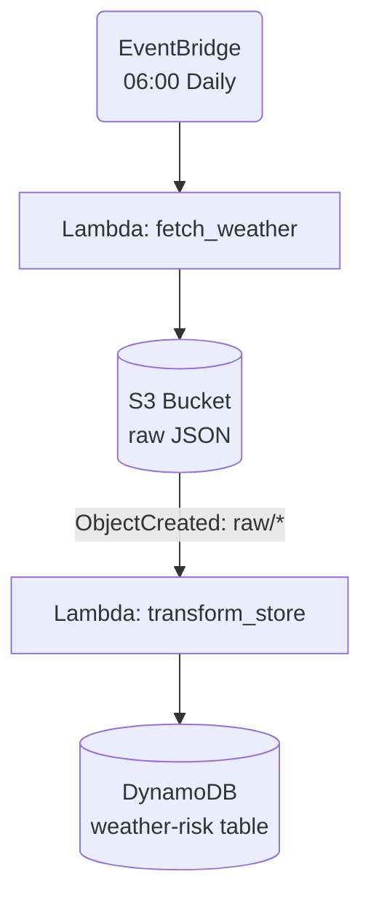

# **_stormwatcher_**

<!-- Tech Stack Badges -->


----


----
# About

A lightweight, serverless daily weather ingestion and risk-scoring pipeline built on AWS.
At 06:00 every morning, Stormwatcher fetches a weather forecast from Open-Meteo’s API, lands the untouched JSON payload in S3, then processes it through a second Lambda to compute a daily risk score and store the result in DynamoDB for downstream consumption.

Stormwatcher deliberately uses an S3 file landing zone rather than processing the API response inline. This mirrors the legacy orchestration patterns I work with (file drops, watchers, multi-stage pipelines) while modernising them into a fully serverless architecture.

Storing the raw file:

- preserves source data for replay, debugging, and audit
- cleanly decouples ingestion from transformation
- enables event-driven processing (S3 -> Lambda)
- reflects real-world batch/ETL patterns such as the Autosys file-triggered systems found in many enterprise environments

This project demonstrates practical, production-aligned AWS skills across Terraform IaC, EventBridge scheduling, Lambda orchestration, S3 event triggers, DynamoDB modelling, and environment-based configuration.

---

# **Table of Contents**
- [Architecture Overview](#architecture-overview)
- [Terraform Infrastructure](#terraform-infrastructure)
- [How to Deploy](#how-to-deploy)
- [How to Test the Pipeline](#how-to-test-the-pipeline)
- [Runtime Configuration](#runtime-configuration)
- [Repository Structure](#repository-structure)
- [Current Status](#current-status)
- [License](#license)

---

## **Architecture Overview**



### **Lambda #1 - fetch_weather**
- Retrieves forecast data from Open-Meteo's API.
- Normalises it into a consistent JSON structure.
- Writes the payload to S3 under `raw/{timestamp}-{location}.json`.

### **Lambda #2 - transform_store**
- Triggered automatically by S3 PUT events.
- Extracts weather values and applies custom risk logic (temp, rain, wind, weathercode scoring).
- Stores the processed item in DynamoDB with:
  - **PK** = uppercased location (`EDINBURGH`)
  - **SK** = Unix timestamp of the forecast
- Attributes include temps, precipitation probabilities, weathercode label, risk_score, and risk_level.

---

## **Terraform Infrastructure**

_stormwatcher_ is fully IaC-driven. Terraform provisions:

### **Core Services**
- **S3 bucket**  
  - Randomised name: `stormwatch-raw-json-xxxxxx`  
  - Stores raw daily forecast data  
  - Lifecycle rules can be added to expire old data

- **DynamoDB table**  
  - Randomised name: `stormwatch-risk-db-xxxxxx`  
  - Key schema:  
    - `PK` (location) - String  
    - `SK` (unix_timestamp) - Number  
  - Pay-per-request billing

### **Compute**
- **Lambda: fetch_weather**
  - Writes JSON files into the S3 bucket  
  - Environment-driven configuration for location, timezone, forecast days, and bucket name

- **Lambda: transform_store**
  - Triggered by S3 events  
  - Reads raw JSON and writes processed records to DynamoDB

### **Orchestration**
- **EventBridge schedule**  
  - Daily invocation at **06:00 Europe/London**  
  - Runs the fetch_weather Lambda

### **Notifications**
- **S3 -> Lambda** event trigger  
  - `s3:ObjectCreated:*` on prefix `raw/`  
  - Invokes the transform_store Lambda automatically

---

## **How to Deploy**

Ensure you have:

- Terraform ≥ 1.5  
- AWS credentials with permissions for Lambda, S3, DynamoDB, IAM, EventBridge  

Then:

```bash
cd infra/terraform
terraform init
terraform apply
```

Terraform will output the deployed resource names, including:

- Raw S3 bucket
- DynamoDB table
- Lambda ARNs

---

## **How to Test the Pipeline**

### **Manual run (simulates daily execution)**

1. Go to **Lambda -> fetch_weather**  
2. Click **Test** with event `{}`  
3. Check S3 bucket -> a new file should appear under `raw/…`

### **Automatic transform step**

When the new file lands:

- S3 triggers `transform_store`
- DynamoDB receives a new item with full weather+risk data

Check:
- **DynamoDB -> Items tab**  
- **CloudWatch Logs** for both Lambdas if debugging

---

## **Runtime Configuration**

_stormwatcher_ relies on environment variables so the same code can be deployed across regions or locations.

### **Lambda #1 - fetch_weather**
| Variable | Purpose |
|----------|----------|
| WEATHER_API_BASE_URL | Open-Meteo endpoint |
| LOCATION_NAME | Human-readable location (also becomes PK) |
| LOCATION_LAT / LOCATION_LON | Coordinates for forecast |
| TIMEZONE | Timezone passed to API |
| FORECAST_DAYS | Number of days to request |
| RAW_BUCKET_NAME / RAW_BUCKET_PREFIX | S3 destination |

### **Lambda #2 - transform_store**
| Variable | Purpose |
|----------|----------|
| WEATHERRISK_TABLE_NAME | DynamoDB table for processed items |

See [`env-vars.md`](./docs/env-vars.md) for the full reference.

---

## **Repository Structure**

```
stormwatcher/
  lambdas/
    fetch_weather/
      handler.py
      logic.py
    transform_store/
      handler.py
      logic.py
  infra/
    terraform/
      eventbridge.tf
      lambda_fetch.tf
      lambda_transform.tf
      main.tf
      outputs.tf
      providers.tf
      s3_notifications.tf
  docs/
    env-vars.md
  README.md
```

---

## **Current Status**

Core pipeline complete  
- Scheduled weather ingestion  
- Raw landing zone  
- Automated transform  
- Risk scoring logic  
- Persistent NoSQL storage  
- Full IaC with Terraform  

Next steps (not yet implemented):  
- CloudWatch alarms (Lambda errors)  
- DynamoDB Streams -> alerting Lambda  
- REST read-API for the last 7 days  
- Optional: small frontend

---

## **License**

[Apache 2.0](LICENSE)