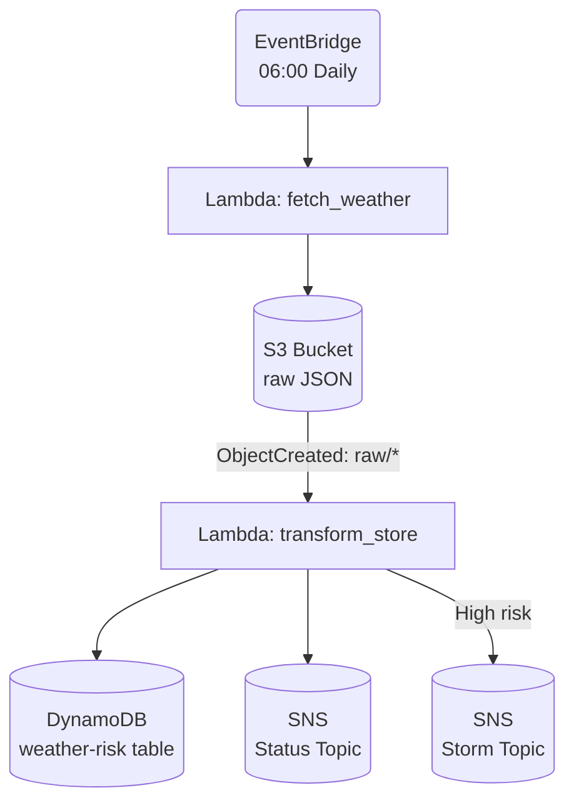

# **_stormwatcher_**

<!-- Tech Stack Badges -->


----


----

## About

A lightweight, serverless daily weather ingestion and risk-scoring pipeline built on AWS.

At 06:00 every morning, **stormwatcher**:

1. Fetches a weather forecast from Open-Meteo’s API.
2. Lands the untouched JSON payload in S3 under a `raw/` prefix.
3. Processes that JSON through a second Lambda to compute a daily risk score.
4. Stores the result in DynamoDB for downstream consumption.
5. Sends optional **status notifications** for each write.
6. Sends optional **storm alerts** when risk crosses a configurable threshold.

The pipeline deliberately uses an S3 file landing zone rather than processing the API response inline. This mirrors the legacy orchestration patterns I work with (file drops, watchers, multi-stage pipelines) while modernising them into a fully serverless architecture.

Storing the raw file:

- preserves source data for replay, debugging, and audit  
- cleanly decouples ingestion from transformation  
- enables event-driven processing (S3 -> Lambda)  
- reflects real-world batch/ETL patterns such as Autosys-style file-triggered systems used in many enterprises  

This project demonstrates practical, production-aligned AWS skills across Terraform IaC, EventBridge scheduling, Lambda orchestration, S3 event triggers, DynamoDB modelling, SNS-based notification patterns, and environment-based configuration.

---

## Table of Contents

- [Architecture Overview](#architecture-overview)
- [Terraform Infrastructure](#terraform-infrastructure)
- [How to Deploy](#how-to-deploy)
- [How to Test the Pipeline](#how-to-test-the-pipeline)
- [Runtime Configuration](#runtime-configuration)
- [Notifications](#notifications)
- [Repository Structure](#repository-structure)
- [Current Status](#current-status)
- [Next Steps](#next-steps)
- [License](#license)

---

## Architecture Overview



### Lambda #1 - `fetch_weather`

- Retrieves forecast data from Open-Meteo's API.
- Normalises it into a consistent JSON structure:

  ```json
  {
    "date": "2025-11-29",
    "unix_timestamp": 1732905600,
    "location": "Edinburgh",
    "raw": { ... }
  }
  ```

- Writes the payload to S3 under:

  ```text
  raw/{date}-{unix_timestamp}-{location-slug}.json
  ```

  Example:

  ```text
  raw/2025-11-29-1732905600-edinburgh.json
  ```

### Lambda #2 - `transform_store`

- Triggered automatically by **S3 PUT** events on the `raw/` prefix.
- Loads the S3 JSON and passes it to `build_db_item()` to compute:
  - `temp_min` / `temp_max` / `temp_mean`  
  - `precip_prob_max`  
  - `wind_speed_max` / `wind_gust_max`  
  - `weathercode` + label (`wc_label`)  
  - `risk_score` (0-1)  
  - `risk_level` (`LOW` / `MEDIUM` / `HIGH`)
- Writes the processed item into DynamoDB with:
  - **PK** = uppercased location (`EDINBURGH`)
  - **SK** = Unix timestamp of the forecast

- Sends notifications:
  - A **status** message to the status SNS topic (success/failure).
  - A **storm** alert to the storm SNS topic when `risk_score` exceeds `STORM_THRESHOLD` (default: `0.8`).

### DynamoDB Design

- **Partition key (PK):** uppercased location, e.g. `EDINBURGH`  
- **Sort key (SK):** `unix_timestamp` (Number)  

Each item also stores the derived risk metrics and weather attributes.

---

## Terraform Infrastructure

**stormwatcher** is fully IaC-driven. Terraform provisions:

### Core Services

- **S3 bucket**
  - Randomised name, e.g. `stormwatch-raw-json-xxxxxx`
  - Stores raw daily forecast data under `raw/`
  - Lifecycle rules added to expire old data

- **DynamoDB table**
  - Randomised name, e.g. `stormwatch-risk-db-xxxxxx`
  - Key schema:
    - `PK` (location) - String
    - `SK` (unix_timestamp) - Number
  - Pay-per-request billing mode

### Compute

- **Lambda: `fetch_weather`**
  - Fetches weather from Open-Meteo.
  - Writes JSON files into the S3 bucket.
  - Configuration entirely via environment variables (location, timezone, forecast days, bucket, prefix).

- **Lambda: `transform_store`**
  - Triggered by S3 events.
  - Applies risk-scoring logic and writes records to DynamoDB.
  - Emits SNS notifications for visibility and alerting.

### Orchestration

- **EventBridge rule**
  - Daily schedule at **06:00 Europe/London**.
  - Invokes `fetch_weather` Lambda.

### Notifications

- **S3 -> Lambda** event source
  - Event: `s3:ObjectCreated:*` on prefix `raw/`.
  - Triggers `transform_store` Lambda.

- **SNS topics**
  - `STATUS_TOPIC_ARN`: status / write outcome notifications.
  - `STORM_TOPIC_ARN`: high-risk “storm incoming” alerts.

---

## How to Deploy

Prerequisites:

- Terraform ≥ 1.5  
- AWS credentials with permissions for:
  - Lambda
  - S3
  - DynamoDB
  - IAM
  - EventBridge
  - SNS

From the repo root:

```bash
cd infra/terraform
terraform init
terraform apply
```

Terraform will:

- Create the S3 bucket and DynamoDB table.
- Deploy both Lambdas and their IAM roles.
- Wire up EventBridge, S3 notifications, and SNS topics.
- Output the deployed resource names and ARNs.

You can inspect outputs with:

```bash
terraform output
```

---

## How to Test the Pipeline

### 1. Trigger the Daily Fetch Manually

1. Go to **AWS Lambda -> `fetch_weather`**.
2. Click **Test** with an event like `{}`.
3. Check the S3 bucket for a new object under `raw/`:

   ```text
   raw/2025-11-29-1732905600-edinburgh.json
   ```

### 2. Confirm Transform & Store

When the S3 object lands:

- S3 triggers `transform_store`.
- `transform_store` reads, transforms, and writes a new item into DynamoDB.

To verify:

1. Go to **DynamoDB -> Tables -> stormwatch-risk-db-xxxxxx**.
2. Open the **Items** tab and query for `PK = "EDINBURGH"`.
3. You should see a row with today's `SK` (unix timestamp) and risk metrics.

### 3. Check Logs & Notifications

- **CloudWatch Logs** for each Lambda:
  - Execution traces, errors, and debug output.
- **SNS**:
  - If you have subscriptions on the topics, you should receive:
    - A **status** notification for each successful/failed write.
    - A **storm** notification if today's `risk_score` ≥ `STORM_THRESHOLD`.

---

## Runtime Configuration

stormwatcher relies on **environment variables**, populated by Terraform, so the same code can be deployed into different regions/locations without modification.

See [`docs/env-vars.md`](./docs/env-vars.md) for a full reference.

### Lambda #1 - `fetch_weather`

| Variable              | Purpose                                                      | Example                             |
| --------------------- | ------------------------------------------------------------ | ----------------------------------- |
| `WEATHER_API_BASE_URL` | Base URL for weather API                                     | `https://api.open-meteo.com/v1/forecast` |
| `LOCATION_NAME`       | Human-readable location name (also used as DynamoDB PK, uppercased) | `Edinburgh`                         |
| `LOCATION_LAT`        | Latitude of target location                                  | `55.9486`                           |
| `LOCATION_LON`        | Longitude of target location                                 | `-3.1999`                           |
| `TIMEZONE`            | Timezone for API results                                     | `Europe/London`                     |
| `FORECAST_DAYS`       | Number of days of forecast to fetch                          | `1`                                 |
| `RAW_BUCKET_NAME`     | S3 bucket for raw JSON drops                                 | `stormwatch-raw-json-xyz123`        |
| `RAW_BUCKET_PREFIX`   | Prefix for stored JSON files                                 | `raw/`                              |

Notes:

- `RAW_BUCKET_PREFIX` defaults to `raw/` in the code if not supplied.
- `LOCATION_NAME` is used for both S3 key naming and the DynamoDB partition key.

### Lambda #2 - `transform_store`

| Variable               | Purpose                                             | Example                          |
| ---------------------- | --------------------------------------------------- | -------------------------------- |
| `WEATHERRISK_TABLE_NAME` | DynamoDB table for processed data                 | `stormwatch-risk-db-xyz123`      |
| `STATUS_TOPIC_ARN`     | SNS topic ARN for write status notifications (optional) | `arn:aws:sns:...:status-topic`   |
| `STORM_TOPIC_ARN`      | SNS topic ARN for storm alerts (optional)          | `arn:aws:sns:...:storm-topic`    |
| `STORM_THRESHOLD`      | Threshold for triggering storm alerts (0-1 float)  | `0.8`                            |

Notes:

- If `STATUS_TOPIC_ARN` or `STORM_TOPIC_ARN` are **not** set, the Lambda safely skips publishing to SNS.
- `STORM_THRESHOLD` defaults to `0.8` when not provided.

---

## Notifications

### Status Notifications

For every processed S3 object, `transform_store` sends a status notification (if `STATUS_TOPIC_ARN` is configured).

**On success**, the SNS message body looks like:

```json
{
  "status": "SUCCESS",
  "location": "Edinburgh",
  "date": "2025-11-29",
  "risk_score": 0.52,
  "risk_level": "MEDIUM",
  "pk": "EDINBURGH",
  "sk": 1732905600
}
```

Subject line example:

```text
Stormwatch write SUCCESS for Edinburgh 2025-11-29
```

**On failure**, the message contains the error string and any context that was available:

```json
{
  "status": "FAILURE",
  "error": "Traceback or error message here",
  "location": "Edinburgh",
  "date": "2025-11-29"
}
```

### Storm Notifications

When `risk_score` ≥ `STORM_THRESHOLD` (default `0.8`), a “storm incoming” message is pushed to `STORM_TOPIC_ARN`.

Subject line example:

```text
Storm incoming: Edinburgh 2025-11-29 (risk=HIGH)
```

Body includes the core metrics driving the score:

```json
{
  "location": "Edinburgh",
  "date": "2025-11-29",
  "risk_score": 0.88,
  "risk_level": "HIGH",
  "temp_max": 5.4,
  "precip_prob_max": 90,
  "wind_speed_max": 20.0,
  "wind_gust_max": 35.0,
  "weathercode": 82,
  "wc_label": "heavy_rain"
}
```

You can wire this topic up to:

- Email subscriptions (simple alerts)
- Slack / Teams via HTTPS endpoint
- Incident management tools (Opsgenie / PagerDuty / etc.)

---

## Repository Structure

```text
stormwatcher/
  docs/
    env-vars.md
  frontend/                # (planned) UI for risk visualisation
  infra/
    terraform/
      build/
        fetch_weather.zip
        transform_store.zip
      eventbridge.tf
      lambda_fetch.tf
      lambda_transform.tf
      main.tf
      outputs.tf
      providers.tf
      s3.tf
      sns.tf
      terraform.tfvars
      variables.tf
  lambdas/
    fetch_weather/
      handler.py
      logic.py
    transform_store/
      handler.py
      logic.py
    prototypes/
      fetch_weather.py
      transform_store.py
  README.md                # This file
  pyproject.toml           # Formatting (Black), etc.
```

---

## Current Status

**Core pipeline: complete**

- Scheduled weather ingestion via EventBridge  
- Raw JSON landing in S3 (`raw/` prefix)  
- Automated transform + risk scoring Lambda  
- DynamoDB time-series storage (PK = location, SK = Unix timestamp)  
- Environment-driven configuration for all components  
- Full Terraform IaC for infrastructure and wiring  
- SNS-based write-status notifications  
- SNS-based storm alerts with configurable risk threshold  

The project is now a self-contained, fully serverless batch/ETL-style workflow suitable as a portfolio piece for cloud, DevOps, or workload automation roles.

---

## Next Steps

Ideas for future iterations:

- **Data validation** - Expand `transform_store` Lambda to conduct data validation before processing 
- **Read API** - API Gateway + Lambda to query:
  - latest day for a location
  - last N days (e.g. 7-day history)
- **Frontend** - small static site (S3 + CloudFront) visualising:
  - today’s risk level
  - recent trend
- **CloudWatch alarms** - on Lambda error rates and throttling.
- **DynamoDB Streams** - drive additional notification or archival workflows from change streams.

---

## License

[Apache 2.0](LICENSE)